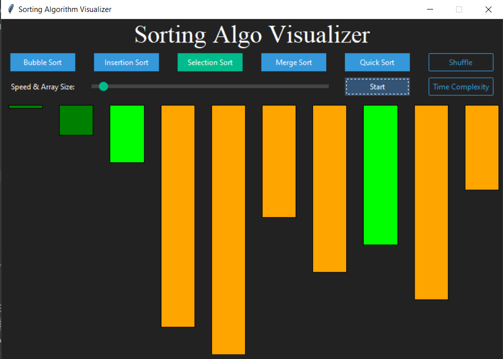

# SortingAlgoVisualizer
<b><i>SortingAlgoVisualizer is a tkinter gui to visualize sorting algorithm with dynamic speed and number of elements.</i></b>

<h1>Libraries used:</h1> 
<ul>
<b><i>
<li>Tkinter & TkBootstrap</li>
<li>Thread</li>
<li>Time</li>
<li>Pyinstaller</li>
<li>Numpy</li>
</b></i>
</ul>

<h1>Features:</h1>
<ul>
<b><i>

<li>Visualize the sorting of an array.</li>
<li>Dynamic Speed and Size of the random elements in an array using slider function.</li>
<li>Note of time complexity of each sorting algorithms.</li>
<li>Change the elements in an array by clicking on shuffle button.
<li>Using Threads to improve performance of the GUI.</i></b>
</ul>

<h1>Download the GUI <i><a href="https://drive.google.com/file/d/1c_rfZoXpDPGAe2tqE96h8GoF5BHeu28m/view?usp=share_link">Link</a></i></h1>
